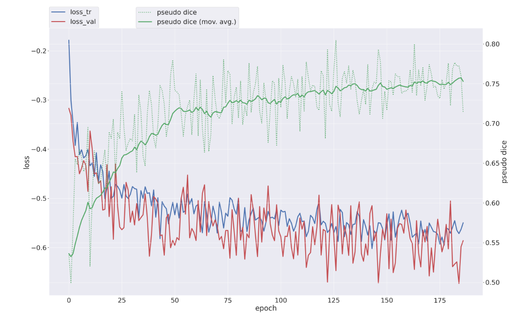
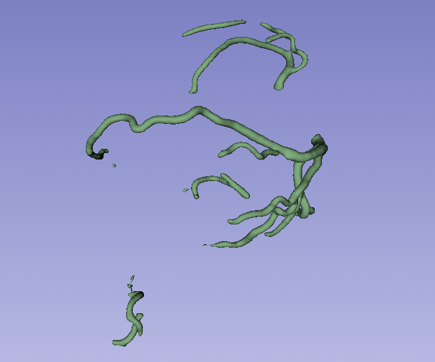

# AMS Izziv 2025 - metoda STU-Net
Avtor: Lara Tušek Oklobdžija

V sklopu projekta je bilo izvedeno fino učenje, inferenca in evalvacija modelov STU-Net in nnUNet za segmentacijo koronarnih arterij na podatkovni zbirki ImageCAS.


Struktura projekta je naslednja:

```bash
├── code
│   ├── base_ep4k.model
│   ├── create_split.py
│   ├── Dockerfile
│   ├── img_metrics.png
│   ├── img_slicer.png
│   ├── load_weights.py
│   ├── nnUNet_results_new
│   ├── prepare_test_data.py
│   ├── __pycache__
│   ├── README.md
│   ├── results_metrics.csv
│   ├── run_inference.py
│   ├── run_test.py
│   ├── run_training_nnunet.py
│   ├── run_training_stunet.py
│   ├── splits_final_200.json
│   └── STU-Net
└── data_test
    └── Dataset001_ImageCAS
```

---

## Pregled rezultatov

Za učenje modelov je bila uporabljena razdelitev podatkov v splits_final_200.json (200 učnih + 40 validacijskih primerov). 

Modela sta bila testirana na 60 testnih primerih (ID 751-810). Napovedi za oba modela se nahajajo znotraj mape data_test/predictions.

Rezultati za klasične in topološke metrike so zbrani v tabeli.

<div align="center">

| Model | Dice Score ↑ | IoU ↑ | Sens ↑ | clDice ↑ | VOI ↓ | $\beta$-Error ↓ |
| :--- | :---: | :---: | :---: | :---: | :---: | :---: |
| **nnUNet** | 0,7326 | 0,5816 | 0,7657 | 0,7903 | 0,0143 | 16,2 |
| **STU-Net-B** | 0,7702 | 0,6285 | 0,7329 | 0,8402 | 0,0116 | 10,9|

</div>

<div align="center">
  
  <br>
  <em>Potek učenja STU-Net modela</em>
</div>

<br>

<div align="center">
  
  <br>
  <em>Prikaz segmentacije v programu 3D Slicer</em>
</div>

---
## Zagon projekta

### Zahteve pred zagonom

Ustvarjanje docker image:

```bash
docker build -t larat_amsizziv .
```
Nalaganje prednaučenih uteži STU-Net-B:

```bash
docker run --rm -it --gpus 'device=0' --shm-size=16g -v "$(pwd)":/workdir larat_amsizziv python code/load_weights.py
```

### Fino učenje STU-Net-B

Za zagon STU-Net treniranja je pripravljena skripta: 

```bash
python run_training_stunet.py DATASET_NAME_OR_ID CONFIGURATION FOLD -tr TRAINER -pretrained_weights MODEL -p PLAN_ID
```

Zagon skripte:

```bash
docker run --rm -it --gpus 'device=0' --shm-size=16g \
-v "$(pwd)/code":/workdir/code \
-v /media/FastDataMama/new_nnunet/nnUNet/nnunet/nnUNet_preprocessed:/workdir/data/nnUNet_preprocessed \
-v /media/FastDataMama/larat/ams_izziv/code/splits_final_200.json:/workdir/data/nnUNet_preprocessed/Dataset001_ImageCAS/splits_final.json \
larat_amsizziv python code/run_training_stunet.py Dataset001_ImageCAS 3d_fullres 0
```

### Učenje nnUNet

Za zagon nnUNet treniranja je pripravljena skripta: 

```bash
python run_training_nnnet.py DATASET_NAME_OR_ID CONFIGURATION FOLD
```

Zagon skripte:
```bash
docker run --rm -it --gpus 'device=1' --shm-size=16g \
-v "$(pwd)/code":/workdir/code \
-v /media/FastDataMama/new_nnunet/nnUNet/nnunet/nnUNet_preprocessed:/workdir/data/nnUNet_preprocessed \
-v /media/FastDataMama/larat/ams_izziv/code/splits_final_200.json:/workdir/data/nnUNet_preprocessed/Dataset001_ImageCAS/splits_final.json \
-v /media/FastDataMama/Mark/U-mamba_AMS/data/nnUNet_raw:/workdir/data/nnUNet_raw \
larat_amsizziv run_training_nnunet.py Dataset001_ImageCAS 3d_fullres 0
```

### Inferenca

Za zagon inference obeh modelov je pripravljena skripta:

```bash
python run_inference.py -i INPUT_PATH -o OUTPUT_PATH -d DATASET -tr TRAINER -c CONFIGURATION -chk CHECKPOINT -f FOLD -npp NUM_PROC_PREPROCESS -nps NUM_PROC_SEGMENTATION
```
Inferenca STU-Net:

```bash
docker run --rm -it --gpus 'device=0' --shm-size=16g \
-v "$(pwd)/code":/workdir/code \
-v "$(pwd)/data_test":/workdir/data_test \
larat_amsizziv python code/run_inference.py -i 'data_test/Dataset001_ImageCAS/imagesTs' -o 'data_test/Dataset001_ImageCAS/predictions/imagesTs_pred_stunet' -d 1 -tr STUNetTrainer_base_ft
```
Inferenca nnUNet:

```bash
docker run --rm -it --gpus 'device=0' --shm-size=16g \
-v "$(pwd)/code":/workdir/code \
-v "$(pwd)/data_test":/workdir/data_test \
larat_amsizziv python code/run_inference.py -i 'data_test/Dataset001_ImageCAS/imagesTs' -o 'data_test/Dataset001_ImageCAS/predictions/imagesTs_pred_nnunet' -d 1
```

Priprava testnih podatkov s skripto:
```bash
docker run --rm -it --gpus 'device=0' --shm-size=16g \
-v "$(pwd)/code":/workdir/code \
-v "$(pwd)/data_test":/workdir/data_test \
larat_amsizziv python code/prepare_test_data.py
```


### Evalvacija

Primerjava napovedi (`nnUNet` vs `STU-Net`) z resničnimi podatki (`Ground Truth`) in izračun metrik v `.csv` datoteko:
Skripta sprejme argumente: 

```bash
python run_test.py -p1 PREDICTIONS_PATH1 -p2 PREDICTIONS_PATH2 -gt GT_PATH -o OUTPUT_PATH
```

Skripto sem zagnala na način:
```bash
docker run --rm -it --gpus 'device=0' --shm-size=16g \
-v "$(pwd)/code":/workdir/code \
-v /media/FastDataMama/larat/ams_izziv/data_test:/workdir/data_test \
larat_amsizziv python code/run_test.py -p1 data_test/Dataset001_ImageCAS/predictions/imagesTs_pred_nnunet -p2 data_test/Dataset001_ImageCAS/predictions/imagesTs_pred_stunet -gt data_test/Dataset001_ImageCAS/labelsTs -o code/results_metrics.csv
```

## Naučeni modeli

Naučeni modeli se nahajajo znotraj mape code/nnUNet_results_new.

